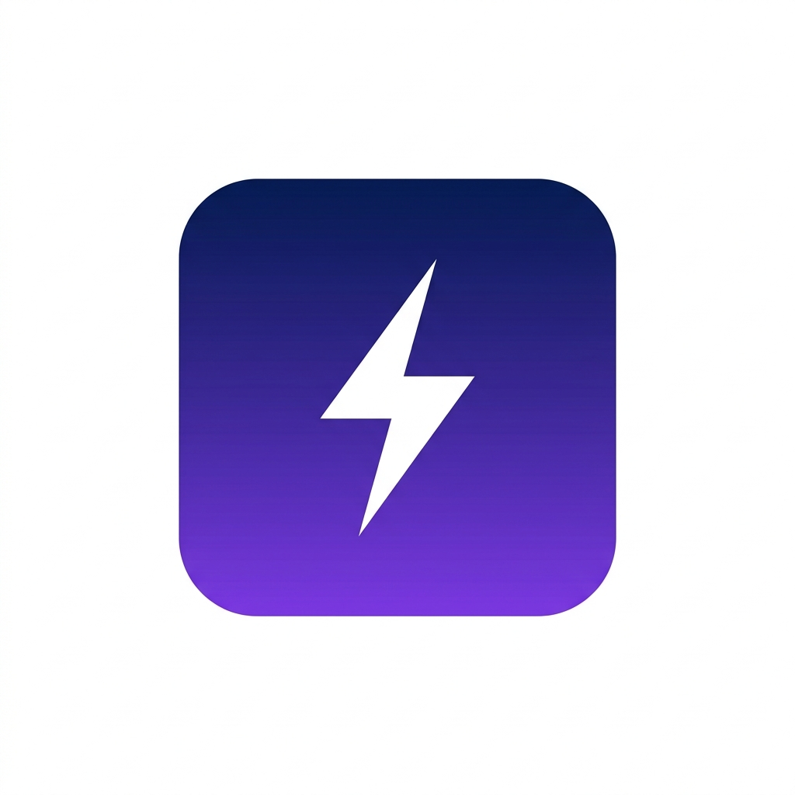

<p align="center">
  
</p>

<h1 align="center">Dashee</h1>
<p align="center">
  <strong>Native macOS dashboard for LiteLLM usage pacing</strong>
</p>

<p align="center">
  <a href="https://github.com/snehmatic/dashee/releases">
    
  </a>
  <a href="https://github.com/snehmatic/dashee/actions">
    
  </a>
  
</p>

---

Dashee is a very personal, minimal, native desktop utility for monitoring [LiteLLM Gateway](https://github.com/BerriAI/litellm) API limits and budget pacing. Built entirely in SwiftUI, it runs as a lightweight background agent on macOS.

## Features

- **Background Agent (`LSUIElement`)**: Runs silently in the background without cluttering the Dock or App Switcher.
- **Menu Bar Integration**: Quick access drop-down showing daily spend limits and budget burn progress.
- **Native Charts**: View historical 7-day spend trends natively via Swift Charts.
- **Local Storage**: API credentials and config are saved securely to macOS `UserDefaults`.

## Installation

Install via Homebrew:

```bash
brew tap snehmatic/dashee
brew install --cask dashee
```

## Build from Source

This app is built via `swiftc` without requiring Xcode project files.

```bash
git clone https://github.com/snehmatic/dashee.git
cd dashee
make build
```
The compiled bundle will be available in the `dist/` directory.

## Documentation

For deployment workflows and release instructions, refer to the [Release Guide](RELEASE_GUIDE.md).

## License

[Apache License 2.0](LICENSE)
